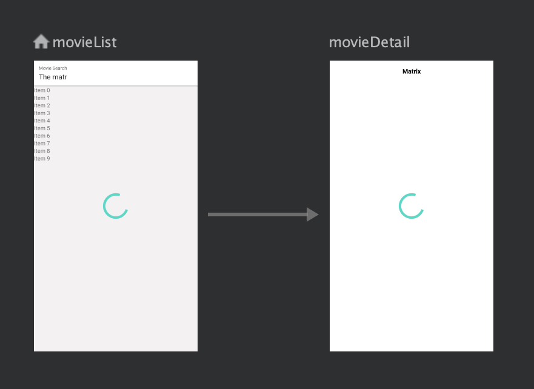

# OMDB Movie Search
Search movies from omdb, loads list and detail

## UI ##

* Android ViewModel, Live Data, View State wrapped content delivered to UI
* Recycler View
* Android Navigation components for storyboard and easy navigation

## API ##

* Retrofit and OkHttp Client, gson
* Coroutines

## Data ##

* Repository pattern used to separate data retrieval.
* Viewmodel is used to comebine data and state to pass to view.

## TODO ##

* Dependency Injection using Hilt/Koin
* Switch over to Flutter to allow iOS app
* Clean up styles, and extract strings into constants
